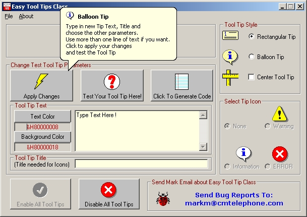



## Easy Balloon Tool Tip Class

### Description

Class module for adding Balloon or Rectangle style tool tips to your forms. Tool Tips can be Multiline and colors are selectable. Because of my other PSC submission

http://www.planet-source-code.com/vb/scripts/ShowCode.asp?lngWId=1&txtCodeId=57128 on how to use Balloon tips in the Systray, which is included in the ZIP, I did some API digging and came up with this.

Also included as part of the demo app is a Code Generator for Tool Tips made with the demo app, so you can cut and paste into your own code.

I'm sure there are many improvments that can be made, but this works, so take it and go play.
 
### More Info
 

             |
---                |---
**Submitted On**   |2004-12-11 15:00:26
**By**             |[Mark Mokoski](https://github.com/Planet-Source-Code/PSCIndex/blob/master/ByAuthor/mark-mokoski.md)
**Level**          |Intermediate
**User Rating**    |4.5 (98 globes from 22 users)
**Compatibility**  |VB 6\.0
**Category**       |[VB function enhancement](https://github.com/Planet-Source-Code/PSCIndex/blob/master/ByCategory/vb-function-enhancement__1-25.md)
**World**          |[Visual Basic](https://github.com/Planet-Source-Code/PSCIndex/blob/master/ByWorld/visual-basic.md)
**Archive File**   |[Easy\_Ballo18282312112004\.zip](https://github.com/Planet-Source-Code/mark-mokoski-easy-balloon-tool-tip-class__1-57489/archive/master.zip)

